### 👋 Olá! Eu sou a Sabrina Bruni

🎓 Estudante universitária apaixonada por tecnologia, programação e desenvolvimento de software.

🔧 Aqui você encontra projetos que estou desenvolvendo na faculdade e também outras experiências que me ajudam a evoluir como desenvolvedora.

🚀 Em constante aprendizado em todas as áreas.

  

### 📫 Me encontre por aqui:

  
  
   

### 🐍 Snake eating my contributions

